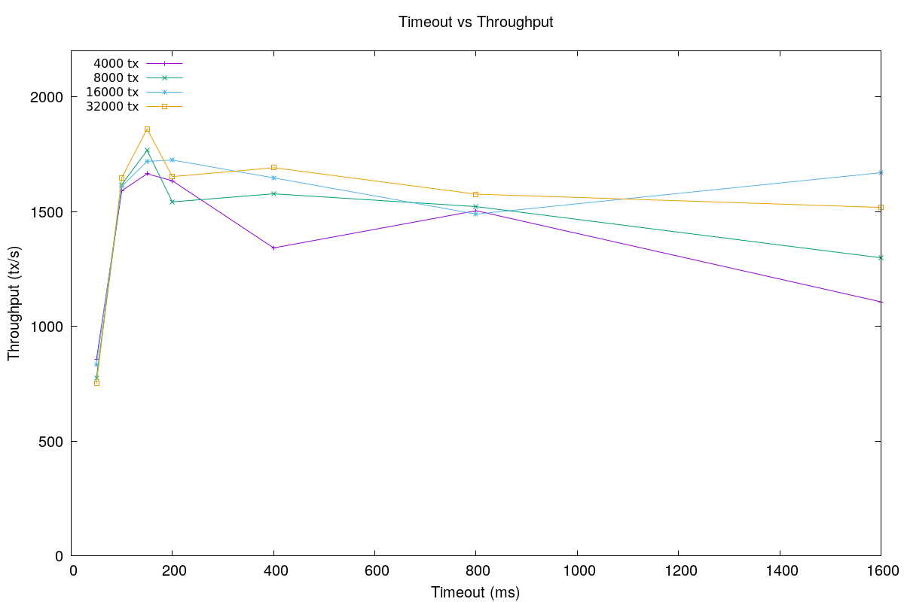
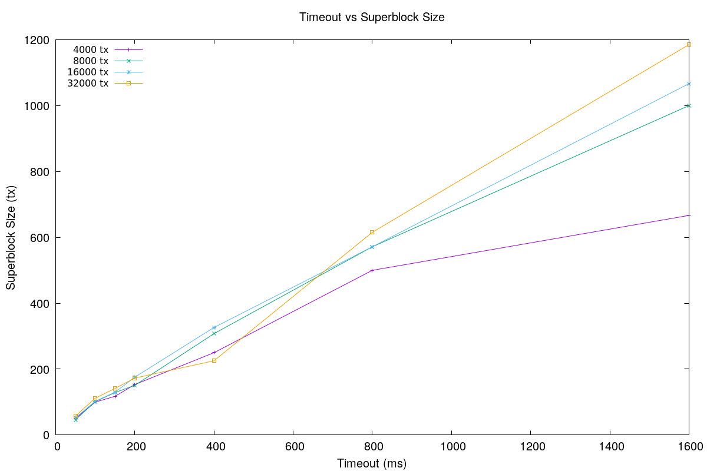
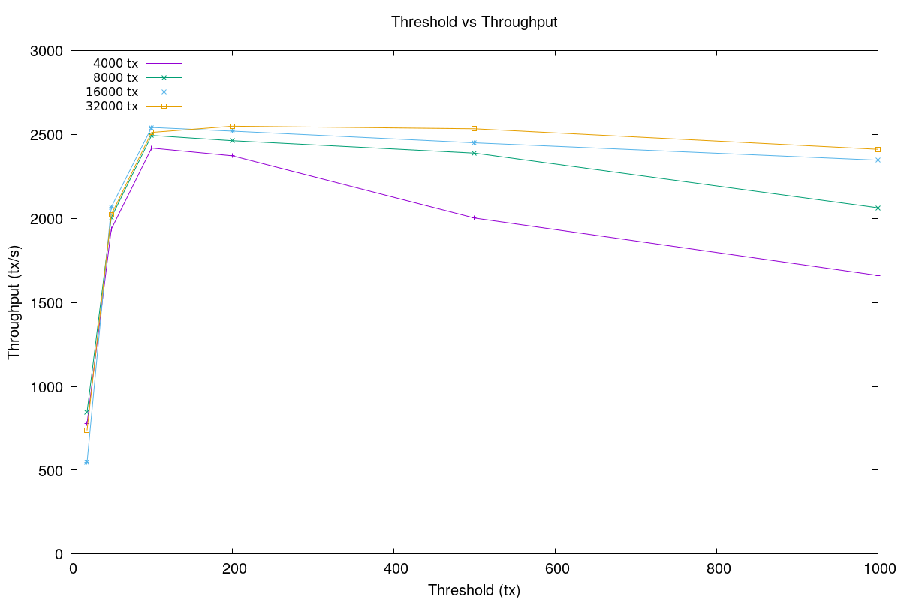
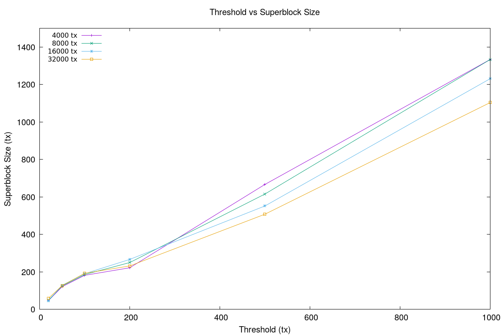
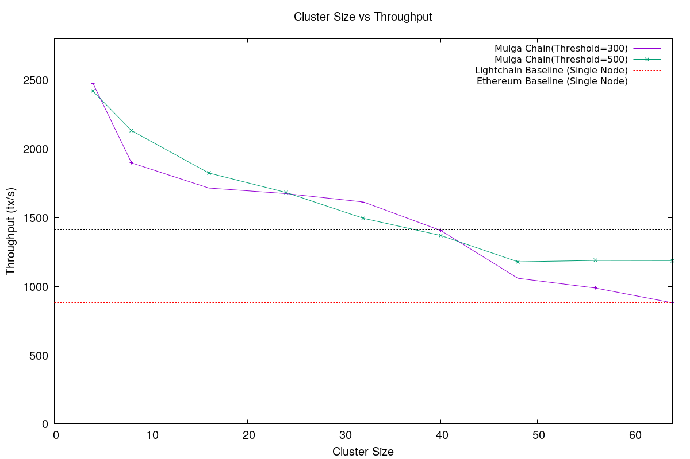
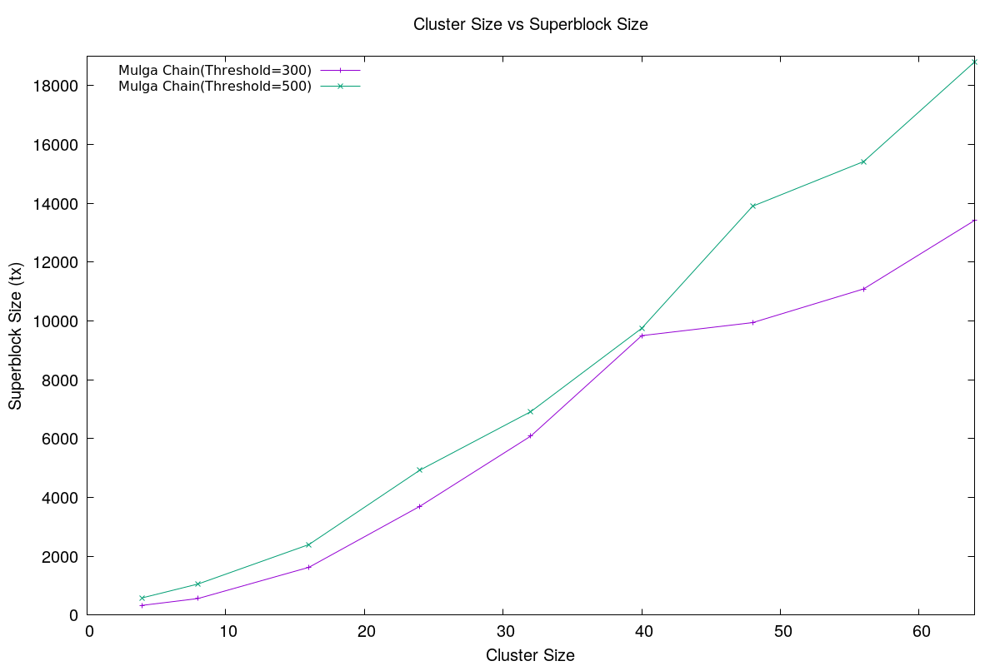

# Benchmark Results

## Benchmark 5

This experiment benchmarks the time it takes to reach consensus in comparison with total time.

### AWS Configuration

- Cluster size: 4, 8, 16, 32
- Instance type: c5.2xlarge
- Availability Zone: ap-southeast-2b
- AMI: ami-00a54827eb7ffcd3c
- OS Image: ubuntu/images/hvm-ssd/ubuntu-bionic-18.04-amd64-server-20191002
- CPU: 8 vCPU
- Memory: 16 GB
- Storage: EBS
- Network: Up to 10 Gigabit

### Mulga Chain Setup

Mulga Chain clusters of size 4, 8, 16, 32 is set up for benchmark.

Transaction pool threshold: 500

Timeout: 5000

### Client Setup

For each node, 5 clients are deployed to concurrently send transactions to the target server. Each client sends 500 transactions

### Results

| Cluster | Total Time (ms) | Consensus Time (ms) | Percentage (%) |
|:-------:|:---------------:|:-------------------:|:--------------:|
|    4    |      37832      |         1221        |      3.23      |
|    8    |      134879     |         7557        |      5.60      |
|    16   |      744094     |        43920        |      7.24      |
|    32   |      604156     |        60111        |      9.95      |

## Benchmark 4

The experiment benchmarks average throughput and average block size of Mulga Chain with different timeout values.

### AWS Configuration

- Cluster size: 4
- Instance type: c5.2xlarge
- Availability Zone: ap-southeast-2b
- AMI: ami-00a54827eb7ffcd3c
- OS Image: ubuntu/images/hvm-ssd/ubuntu-bionic-18.04-amd64-server-20191002
- CPU: 8 vCPU
- Memory: 16 GB
- Storage: EBS
- Network: Up to 10 Gigabit

### Mulga Chain Setup

A Mulga Chain cluster of size 4 and fault-tolerance 1 is set up for benchmark.  The transaction pool threshold is set to 1,000,000 transactions such that it will never propose blocks because it reached threshold.

Average throughput and block size are benchmarked when Mulga Chain nodes are configured to have 100, 200, 400, 800 and 1600 ms. Throughput and block size are benchmarked for work loads of 4000, 8000, 16000 and 32000 transactions.

### Client Setup

For each node, 5 clients are deployed to concurrently send transactions to the target server. The total amount of work load is set to 4000, 8000, 16000 and 32000 transactions.

### Results

#### Throughput (tx/s)

| Timeout (ms) | 4000 tx | 8000 tx | 16000 tx | 32000 tx |
|:------------:|:-------:|:-------:|:--------:|:--------:|
|      50      |  855.5  |  775.8  |   834.8  |   751.6  |
|      100     |  1590.6 |  1617.4 |  1610.0  |  1646.9  |
|      150     |  1664.4 |  1765.9 |  1718.4  |  1859.1  |
|      200     |  1633.5 |  1542.0 |  1723.9  |  1651.9  |
|      400     |  1341.4 |  1577.0 |  1646.4  |  1690.6  |
|      800     |  1503.4 |  1521.4 |  1488.7  |  1575.5  |
|     1600     |  1106.6 |  1298.4 |  1669.1  |  1517.8  |

#### Block Size (tx)

| Timeout (ms) | 4000 tx | 8000 tx | 16000 tx | 32000 tx |
|:------------:|:-------:|:-------:|:--------:|:--------:|
|      50      |   50.0  |   46.2  |   52.8   |   57.8   |
|      100     |  100.0  |  101.3  |   102.6  |   111.9  |
|      150     |  117.6  |  129.0  |   130.1  |   141.6  |
|      200     |  153.4  |  150.9  |   175.8  |   173.0  |
|      400     |  250.0  |  307.7  |   326.5  |   225.4  |
|      800     |   500   |  571.4  |   571.4  |   615.4  |
|     1600     |  666.7  |   1000  |  1066.7  |  1185.2  |

## Benchmark 3

The experiment benchmarks average throughput and average block size of Mulga Chain with different transaction pool threshold value.

### AWS Configuration

- Cluster size: 4
- Instance type: c5.2xlarge
- Availability Zone: ap-southeast-2b
- AMI: ami-00a54827eb7ffcd3c
- OS Image: ubuntu/images/hvm-ssd/ubuntu-bionic-18.04-amd64-server-20191002
- CPU: 8 vCPU
- Memory: 16 GB
- Storage: EBS
- Network: Up to 10 Gigabit

### Mulga Chain Setup

A Mulga Chain cluster of size 4 and fault-tolerance 1 is set up for benchmark. Each node is configured to have transaction pool threshold of 20, 50, 100, 200, 500 and 1000. The timeout is set to 1,000,000 ms such that it will never propose blocks due to timeout.

### Client Setup

For each node, 5 clients are deployed to concurrently send transactions to the target server. The total amount of work load is set to 4000, 8000, 16000 and 32000 transactions.

### Results

#### Throughput (tx/s)

| Threshold (tx) | 4000 tx | 8000 tx | 16000 tx | 32000 tx |
|:--------------:|:-------:|:-------:|:--------:|:--------:|
|       20       |  777.9  |  846.9  |   547.1  |   738.3  |
|       50       |  1935.5 |  2004.4 |  2067.0  |  2021.9  |
|       100      |  2418.5 |  2493.9 |  2541.4  |  2511.9  |
|       200      |  2372.3 |  2462.3 |  2519.5  |  2549.1  |
|       500      |   2002  |  2388.3 |  2449.8  |  2533.6  |
|      1000      |  1660.2 |  2062.9 |  2346.1  |  2411.2  |

#### Block Size (tx)

| Threshold (tx) | 4000 tx | 8000 tx | 16000 tx | 32000 tx |
|:--------------:|:-------:|:-------:|:--------:|:--------:|
|       20       |   47.6  |   50.3  |   46.2   |   60.1   |
|       50       |  121.2  |  125.0  |   129.0  |   127.0  |
|       100      |  181.8  |  186.0  |   190.5  |   192.8  |
|       200      |  222.2  |   250   |   266.7  |   231.9  |
|       500      |  666.7  |  615.4  |   551.7  |   507.9  |
|      1000      |  1333.3 |  1333.3 |  1230.8  |  1103.5  |

## Benchmark 2

Throughput and scalability of Mulga Chain.

### AWS Configuration

- Instance type: c5.2xlarge
- Availability Zone: ap-southeast-2b
- AMI: ami-00a54827eb7ffcd3c
- OS Image: ubuntu/images/hvm-ssd/ubuntu-bionic-18.04-amd64-server-20191002
- CPU: 8 vCPU
- Memory: 16 GB
- Storage: EBS
- Network: Up to 10 Gigabit

### Client Setup

For each node, 5 concurrent Geth clients are deployed and each sends 300 transactions.

If the there are n nodes, then the total amount of clients are 5n and total amount of transactions submitted are 1500n.

### Experiment Setup

| Cluster Size | Tolerance | Number of Clients | Transactions per Client (tx) | Server Workload (tx) | Total Number of Transactions (tx) |
|:------------:|:---------:|:-----------------:|:----------------------------:|:--------------------:|:---------------------------------:|
|       4      |     1     |         20        |              300             |         1500         |                6000               |
|       8      |     2     |         40        |              300             |         1500         |               12000               |
|      16      |     5     |         80        |              300             |         1500         |               24000               |
|      32      |     10    |        160        |              300             |         1500         |               48000               |
|      64      |     21    |        320        |              300             |         1500         |               96000               |

### Result

#### Throughput

| Cluster size | Threshold=300 | Threshold=500 |
|:------------:|:-------------:|:-------------:|
|       4      |     2475.6    |     2418.1    |
|       8      |     1897.1    |     2131.5    |
|      16      |     1714.1    |     1823.5    |
|      24      |      1674     |     1681.8    |
|      32      |     1613.1    |     1494.4    |
|      40      |     1406.2    |     1369.7    |
|      48      |     1058.8    |     1178.3    |
|      56      |     988.0     |     1188.1    |
|      64      |     880.2     |     1187.2    |

#### Block Size

| Cluster size | Threshold=300 | Threshold=500 |
|:------------:|:-------------:|:-------------:|
|       4      |     333.3     |     590.2     |
|       8      |     564.7     |     1058.8    |
|      16      |     1625.0    |      2400     |
|      24      |      3700     |     4928.6    |
|      32      |     6085.7    |     6916.7    |
|      40      |      9500     |      9750     |
|      48      |     9942.9    |     13900     |
|      56      |    11087.5    |    15416.7    |
|      64      |    13414.3    |    18800.0    |

## Benchmark 1

Performance of Mulga Chain on local machine.

### System Setup

- Machine Config:
  - OS: Ubuntu 18.04.3 LTS 64-bit
  - Processor: Intel® Core™ i7-7700HQ CPU @ 2.80GHz × 8
  - Memory: 15.6 GiB
  - Disk: Seagate ST2000LM007-1R81 2T

### Client Configuration

Client concurrently sends batch transactions to Blockchain node. Batch size is configurable.

### Experimental Results

#### Mulga Chain

Four Mulga Chain node on the same machine (N = 4, t = 1)

Mulga Chain proposes a Block either when Tx pool has reached certain threshold (default 100) or timeout (default 1000 millisecond) has expired.

Both parameters are configurable and Timeout is set to 200 in this benchmark.

|            | Throughput (tx/s) |               |               |               |
|:----------:|:-----------------:|:-------------:|:-------------:|:-------------:|
| Batch Size |    Threshold 50   | Threshold 100 | Threshold 200 | Threshold 400 |
|     50     |       128.9       |     130.9     |     125.6     |     125.3     |
|     100    |       149.3       |     191.9     |     178.6     |     182.8     |
|     200    |       201.0       |     256.7     |     238.9     |     239.8     |
|     400    |       212.0       |     278.4     |     284.5     |     247.5     |
|     800    |       234.7       |     313.1     |     311.8     |     251.8     |
|    1200    |       241.6       |     282.4     |     310.6     |     280.1     |
|    1600    |       219.0       |     257.5     |     311.2     |     309.5     |

For Block Size Threshold 800:

| Batch Size | Throughput (tx/s) |
|------------|-------------------|
| 800        | 226.0             |
| 1600       | 283.9             |
| 2400       | 327.2             |
| 3200       | 250.3             |
| 4000       | 248.0             |

#### Light Chain

Single stand-alone Light chain node (virtually no consensus)

| Batch Size | Throughput (tx/s) |
|:----------:|:-----------------:|
|     50     |        24.5       |
|     100    |        24.3       |
|     200    |        82.4       |
|     400    |       126.5       |
|     800    |       121.9       |
|    1200    |       197.7       |
|    1600    |       252.2       |
|    2400    |       249.8       |
|    3200    |       256.4       |
|    4000    |       224.8       |
